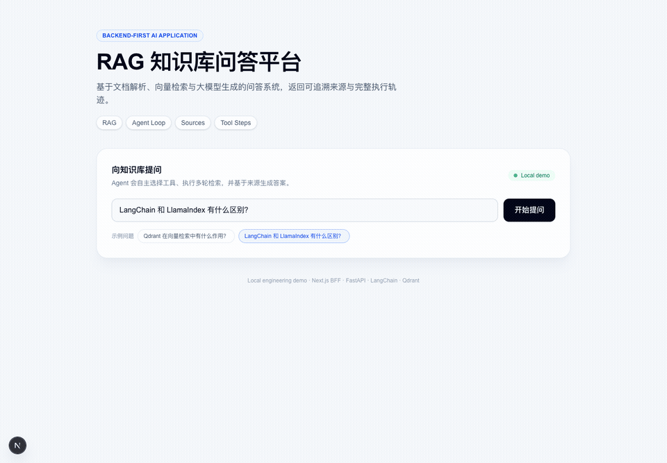
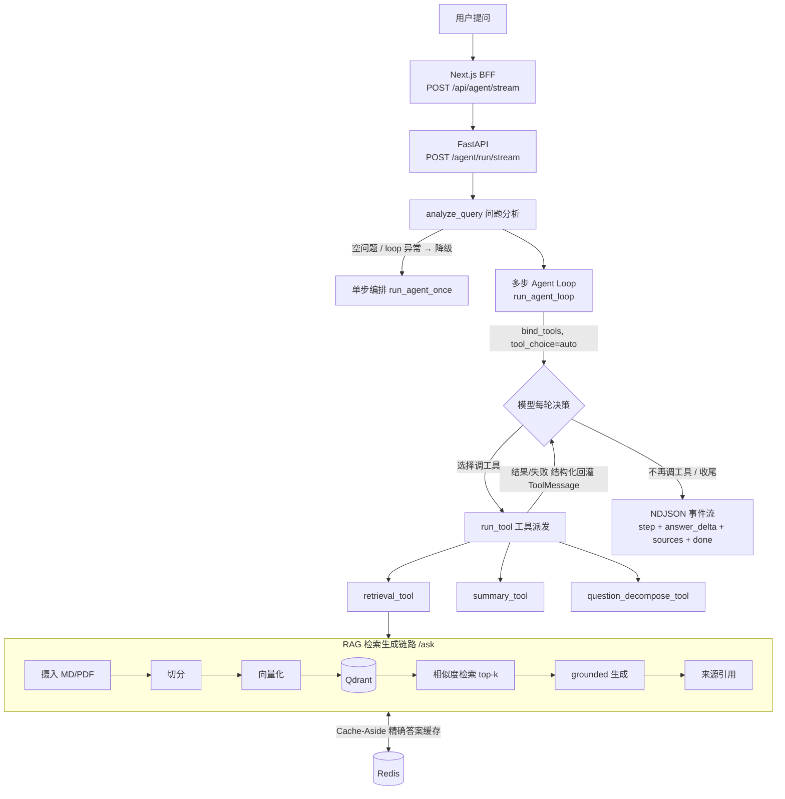

# rag-agent-platform

这是一个从 RAG 知识库问答逐步演进到轻量 Agent 编排的 AI 应用工程项目。

## 本地演示



上图来自本地真实运行环境：Next.js BFF 调用 FastAPI `POST /agent/run/stream`，页面在请求结束前逐步显示工具调用，随后增量展示回答、来源与终止原因。演示问题为“LangChain 和 LlamaIndex 有什么区别？”，本次运行最终以 `final_answer` 结束，并返回 2 轮工具编排与 14 个来源。

当前没有长期运行服务器，因此仓库不提供公网 Demo URL，也不声称项目已经上线。完整系统可以通过下文的 Docker Compose 流程在本地复现；真实接口命令与响应记录见 [`docs/demo/end_to_end.md`](docs/demo/end_to_end.md)。

## 一次多步自主编排长什么样

问 `LangChain 和 LlamaIndex 有什么区别？`，模型在**一次** `/agent/run` 请求里**自主跑了 4 轮**（基于 native function calling，循环方向由模型决定，不是写死的 if/else）：

| 轮次 | 模型自主决策 | 调用的工具 |
| --- | --- | --- |
| 1 | 先把对比问题拆解 | `question_decompose_tool` |
| 2 | 检索框架 A | `retrieval_tool`（"什么是 LangChain"） |
| 3 | 检索框架 B | `retrieval_tool`（"LlamaIndex 框架的主要功能"） |
| 4 | 信息够了，综合作答 | —（`final_answer`） |

结果 `termination_reason = final_answer`，跨轮聚合 6 个来源，全程 `steps` 逐轮可观测。
真实命令与完整响应见 [`docs/demo/end_to_end.md`](docs/demo/end_to_end.md)。

## 架构



当前仓库结构把 RAG 作为 Agent 系统的第一个可运行子项目。`rag` 子项目已经支持文档摄入、批量上传、向量检索、问答生成、流式问答、来源返回、轻量问题分析、检索规划、执行 trace、Prompt 版本管理、Redis Cache-Aside 精确答案缓存、离线评测、LLM-as-Judge 结构化评分和 Prompt A/B 对比报告。`agent` 子项目在 RAG 之上提供编排层：默认走基于 native function calling 的多步 agent loop（模型自主多轮选择并调用工具、工具结果与失败都回灌模型，由模型决定继续调工具还是收尾），并保留规则式单步编排作为降级路径；同时提供兼容的一次性 JSON 接口 `/agent/run` 和真正逐块输出的 NDJSON 接口 `/agent/run/stream`。

当前项目已进入工程收尾阶段：核心功能、自动化测试、端到端演示、request-id 调用链追踪和 token/成本计量均已有代码与验证证据。公网部署因暂无长期服务器资源暂缓，因此项目定位是本地可复现的工程作品，不声称已经生产上线。

## 子项目

| 子项目 | 状态 | 说明 |
| --- | --- | --- |
| `rag` | RAG MVP + 轻量编排基线 | 支持 Markdown/PDF 入库、单文件/批量上传、Qdrant 检索、FastAPI 问答、流式返回、来源引用、执行 trace、Prompt 版本、离线评测、LLM-as-Judge 结构化评分和 Prompt A/B 对比报告 |
| `agent` | 多步 Agent loop 编排 | 支持工具注册、问题分析、工具执行、结构化 trace、工具失败处理、native function calling 多步 loop、NDJSON 流式事件、12-case 编排评测和独立答案质量 Judge |
| `frontend` | Agent 演示界面 | 使用 Next.js App Router + TypeScript；浏览器通过同源 `/api/agent/stream` BFF 消费流，在请求完成前逐步展示工具步骤与答案 |

## 当前能力边界

已经完成并有代码或测试支撑：

- RAG：Markdown/PDF 摄入、单文件上传、批量上传、Qdrant 索引、`/ask`、`/ask/stream`、来源引用、RAG trace、Prompt 版本、Redis 共享精确答案缓存（TTL、索引版本失效、fail-open）、离线评估、LLM-as-Judge 评分报告和 Prompt A/B 对比报告。
- Agent：`retrieval_tool`、`summary_tool`、`question_decompose_tool`、`fallback_tool`、基于 native function calling 的多步 agent loop（`run_agent_loop`，工具失败回灌模型由其自主恢复）+ 规则式单步降级（`run_agent_once`）、`run_tool` 工具派发、executor、AgentState、Agent trace、工具失败结构化返回，以及工具轨迹/结束原因/来源/延迟的离线评测 runner。
- Agent 与 Frontend：`/agent/run/stream` 输出版本化 NDJSON 事件，BFF 不缓冲地转发响应体；页面增量渲染 `step` 和 `answer_delta`，最终接收 `sources` 与 `done`。原 `/agent/run` JSON 接口保持兼容。
- 可观测性：`X-Request-ID` 贯穿 Frontend BFF、Agent 与 RAG 调用链；请求结束记录 LLM 调用次数、输入/缓存输入/输出 token 和可配置成本。
- 大文档：已验证 100 页 PDF 完成解析、切分为 452 个 chunk、写入 Qdrant，并在检索和回答评测中命中。详见 [`rag/experiments/reports/ingestion/large_pdf_ingestion_report.md`](rag/experiments/reports/ingestion/large_pdf_ingestion_report.md)。

## 可复现工程数据

- **测试与构建**：根目录 Python 测试 305 项；前端 Node 测试 25 项，并通过 ESLint、TypeScript 检查和 Next.js production build。
- **Redis 精确缓存**：5 次相同问题实测为 1 次 miss + 4 次 hit，miss 5915.14 ms、hit P50 3.495 ms、命中率 80%，重复请求延迟下降 99.94%；Redis 停机时请求仍通过 fail-open 路径返回。详见 [`rag/experiments/reports/cache/redis_exact_cache_2026-08-05.md`](rag/experiments/reports/cache/redis_exact_cache_2026-08-05.md)。
- **Agent 流式稳定性**：12 条 golden case 全部满足事件协议并正常结束，未出现 reasoning 与 answer 混流；平均首事件 7.796 s、平均首答案 11.683 s。详见 [`agent/experiments/reports/streaming/baseline_2026-08-03.md`](agent/experiments/reports/streaming/baseline_2026-08-03.md)。
- **并发基线**：`/ask` 在并发 1→8 时吞吐从 0.065 提升到 0.427 rps、错误率为 0；结果表明当前并发范围内主要瓶颈是 LLM 生成延迟，而不是线程池。详见 [`agent/experiments/reports/concurrency/baseline_2026-08-04.md`](agent/experiments/reports/concurrency/baseline_2026-08-04.md)。

当前没有证据、因此不应写进简历的能力：

- 平均响应时延 2s 内。
- 上下文命中率提升约 20%。
- AutoGen、网络搜索工具。
- 完整 A/B Prompt 对比平台、300+ 样本或 80+ 组实验。

## 已知边界

- 当前没有长期运行的公网部署，也没有认证、限流或租户隔离；它是本地工程演示，不是生产 SaaS。
- 当前没有 `/metrics` 指标端点或集中式告警，聚合分析仍依赖带 request-id 的日志和离线报告。
- 多步 Agent 的延迟与 token 消耗明显高于单次 RAG；极端情况下应用层与 SDK 重试还会叠加等待时间。
- 上传接口适合可信本地环境，尚未增加文件大小限制、恶意文件扫描或异步任务队列。
- LLM-as-Judge 只作为内部回归信号；多来源回答仍有采样波动，不能把单次通过率解释为稳定质量。

## Docker Compose 一键启动

根目录的 `compose.yaml` 会统一启动以下服务，并通过一次性初始化任务确保 Qdrant collection 存在：

| 服务 | 地址 | 说明 |
| --- | --- | --- |
| Frontend | <http://localhost:3000> | Next.js Agent 问答页面；通过服务端 BFF 访问 Agent API |
| RAG API | <http://localhost:8001> | `/ask`、文档上传和摄入接口 |
| Agent API | <http://localhost:8002> | `/agent/run` JSON 接口、`/agent/run/stream` NDJSON 流接口和工具编排 |
| Qdrant | <http://localhost:6333> | 本地向量数据库 |
| Redis | <http://localhost:6379> | RAG API、Agent API 和索引脚本共享的精确答案缓存与索引版本 |

### 前置条件

- 已安装并启动 Docker。
- 宿主机已安装并启动 Ollama。
- 已下载项目使用的 embedding 模型：

```bash
ollama pull nomic-embed-text
```

Compose 中的后端容器通过 `host.docker.internal:11434` 访问宿主机 Ollama。Linux 如果无法连接，需要让 Ollama 监听容器可访问的地址；只应在可信的本地开发环境中这样配置：

```bash
OLLAMA_HOST=0.0.0.0:11434 ollama serve
```

### 启动项目

1. 创建本地环境变量文件：

```bash
cp .env.example .env
```

2. 编辑 `.env`，至少填写一个可用的 `MOONSHOT_API_KEY` 或 `OPENAI_API_KEY`。真实 `.env` 已被 Git 忽略，不要把密钥提交到仓库。

3. 构建并启动全部服务：

```bash
docker compose up --build -d
```

如果之前通过 `rag/compose.yaml` 启动过独立 Qdrant，需要先执行 `docker compose -f rag/compose.yaml stop qdrant`，避免宿主机 `6333`、`6334` 端口冲突。停止容器不会删除原有 Qdrant 数据。

4. 检查服务状态：

```bash
docker compose ps
curl http://localhost:8001/health
curl http://localhost:8002/health
```

首次启动会创建空的 Qdrant collection，但不会自动包含知识库文档。服务启动后，需要按照 [`rag/README.md`](rag/README.md) 上传并摄入文档，然后才能进行有知识库上下文的问答。后续启动会保留已有 collection 和索引数据。

停止服务但保留 Qdrant 和上传数据：

```bash
docker compose down
```

如需同时删除本地 Qdrant 索引和上传数据，可以执行 `docker compose down -v`。这是破坏性操作，已有数据会被清除。

## 当前运行方式

端到端演示记录见 [`docs/demo/end_to_end.md`](docs/demo/end_to_end.md)，包含
upload、ingest、ask、stream ask 和 agent run 的真实 `curl` 命令与响应摘录。

本地开发的 Python 依赖由仓库根目录的 uv workspace 统一管理，先同步环境：

```bash
uv sync
```

之后所有 Python 命令都用 `uv run` 前缀执行，不需要手动激活虚拟环境。

进入 RAG 子项目：

```bash
cd rag
```

然后按照 [`rag/README.md`](rag/README.md) 运行。

进入 Agent 子项目：

```bash
cd agent
uv run pytest tests/ -q
```

Agent API 入口：

```bash
cd agent
uv run uvicorn agent_app.app.main:app --reload
```

更多说明见 [`agent/README.md`](agent/README.md)。

前端本地开发默认由服务端 Route Handler 访问
`http://localhost:8002/agent/run/stream`。如需覆盖地址，只把它设置为服务端环境变量，
不要使用 `NEXT_PUBLIC_` 前缀：

```bash
cd frontend
AGENT_STREAM_API_URL=http://localhost:8002/agent/run/stream npm run dev
```

## English

This repository is a locally reproducible RAG and Agent application built with FastAPI, LangChain, Qdrant, Redis, Next.js App Router, and TypeScript. The [`rag`](rag/) module provides document ingestion, Qdrant retrieval, cited and streaming answers, execution traces, evaluation pipelines, and a shared Redis Cache-Aside exact-answer cache with TTL, index-version invalidation, and fail-open behavior. The [`agent`](agent/) module provides native function-calling orchestration: the model selects tools across multiple rounds, receives structured tool results or failures, and decides whether to continue or produce the final answer. Its tools include retrieval, LLM-based summarization, and question decomposition, with a rule-based single-step fallback for degraded operation.

The [`frontend`](frontend/) module consumes the versioned NDJSON `/agent/run/stream` protocol through a server-only Next.js BFF and renders tool steps, answer deltas, sources, and explicit interrupted-stream errors before the request completes. The animated demo above was captured from the real local stack. A permanent public URL is intentionally not claimed because long-running hosting is currently deferred.
