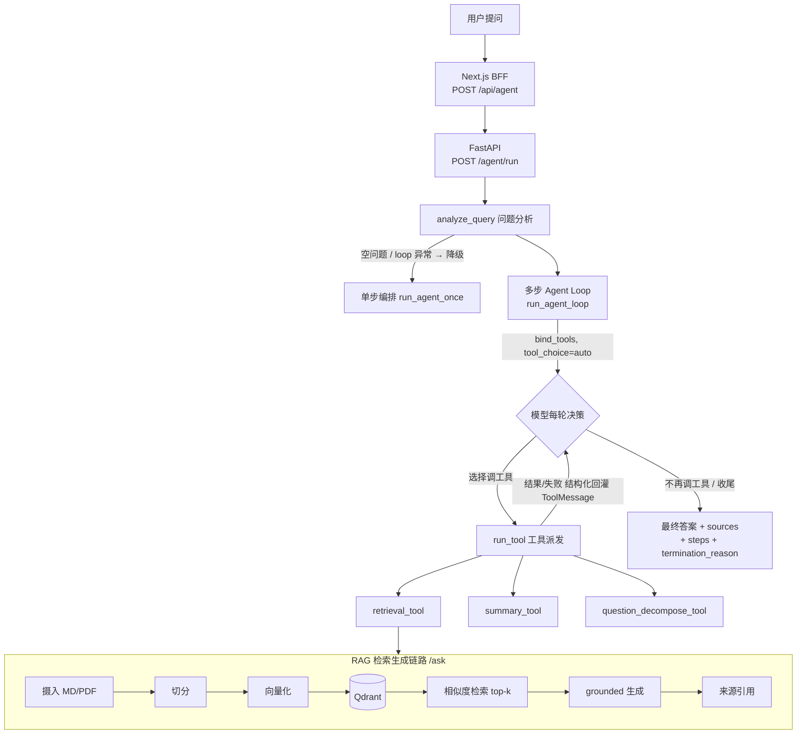

# rag-agent-platform

这是一个从 RAG 知识库问答逐步演进到轻量 Agent 编排的 AI 应用工程项目。

## 一次多步自主编排长什么样

问 `LangChain 和 LlamaIndex 有什么区别？`，模型在**一次** `/agent/run` 请求里**自主跑了 4 轮**（基于 native function calling，循环方向由模型决定，不是写死的 if/else）：

| 轮次 | 模型自主决策 | 调用的工具 |
| --- | --- | --- |
| 1 | 先把对比问题拆解 | `question_decompose_tool` |
| 2 | 检索框架 A | `retrieval_tool`（"什么是 LangChain"） |
| 3 | 检索框架 B | `retrieval_tool`（"LlamaIndex 框架的主要功能"） |
| 4 | 信息够了，综合作答 | —（`final_answer`） |

结果 `termination_reason = final_answer`，跨轮聚合 6 个来源，全程 `steps` 逐轮可观测。
真实命令与完整响应见 [`docs/demo/end_to_end.md`](docs/demo/end_to_end.md)。

## 架构



当前仓库结构把 RAG 作为 Agent 系统的第一个可运行子项目。`rag` 子项目已经支持文档摄入、批量上传、向量检索、问答生成、流式问答、来源返回、轻量问题分析、检索规划、执行 trace、Prompt 版本管理、离线评测、LLM-as-Judge 结构化评分和 Prompt A/B 对比报告。`agent` 子项目在 RAG 之上提供编排层：默认走基于 native function calling 的多步 agent loop（模型自主多轮选择并调用工具、工具结果与失败都回灌模型，由模型决定继续调工具还是收尾），并保留规则式单步编排作为降级路径；支持问题分析、工具规划、工具执行、Agent trace、摘要工具、工具失败状态返回、FastAPI `/agent/run` 接口和 `/health` 健康检查接口。

后续扩展方向是继续在当前 RAG 和轻量 Agent 基线上补齐工程证据，例如大文档处理报告、延迟 benchmark、Agent 目录结构整理、问题拆解工具和 Prompt 评测对比报告。

## 子项目

| 子项目 | 状态 | 说明 |
| --- | --- | --- |
| `rag` | RAG MVP + 轻量编排基线 | 支持 Markdown/PDF 入库、单文件/批量上传、Qdrant 检索、FastAPI 问答、流式返回、来源引用、执行 trace、Prompt 版本、离线评测、LLM-as-Judge 结构化评分和 Prompt A/B 对比报告 |
| `agent` | 多步 Agent loop 编排 | 支持工具注册、问题分析、工具规划、工具执行、摘要工具、结构化 Agent trace、工具失败处理、基于 native function calling 的多步 agent loop（自主多轮工具编排 + 规则式单步降级）、FastAPI `/agent/run` 接口和 `/health` 健康检查接口 |
| `frontend` | Agent 演示界面 | 使用 Next.js App Router + TypeScript；浏览器通过同源 `/api/agent` BFF 调用 Agent，界面展示回答、来源、终止原因和逐轮工具编排步骤 |

## 当前能力边界

已经完成并有代码或测试支撑：

- RAG：Markdown/PDF 摄入、单文件上传、批量上传、Qdrant 索引、`/ask`、`/ask/stream`、来源引用、RAG trace、Prompt 版本、离线评估、LLM-as-Judge 评分报告和 Prompt A/B 对比报告。
- Agent：`retrieval_tool`、`summary_tool`、`question_decompose_tool`、`fallback_tool`、基于 native function calling 的多步 agent loop（`run_agent_loop`，工具失败回灌模型由其自主恢复）+ 规则式单步降级（`run_agent_once`）、`run_tool` 工具派发、executor、AgentState、Agent trace、工具失败结构化返回。
- Frontend：Next.js Route Handler BFF、服务端 Agent 地址、回答和来源展示、多轮 `steps` 可视化；当前 Agent 接口仍是一次性 JSON 响应，不声称 Agent 流式输出。

仍需要补证据后再写进简历的能力：

- 100+ 页 PDF 稳定处理。
- 平均响应时延 2s 内。
- 上下文命中率提升约 20%。
- AutoGen、网络搜索工具。
- 完整 A/B Prompt 对比平台、300+ 样本或 80+ 组实验。

## Docker Compose 一键启动

根目录的 `compose.yaml` 会统一启动以下服务，并通过一次性初始化任务确保 Qdrant collection 存在：

| 服务 | 地址 | 说明 |
| --- | --- | --- |
| Frontend | <http://localhost:3000> | Next.js Agent 问答页面；通过服务端 BFF 访问 Agent API |
| RAG API | <http://localhost:8001> | `/ask`、文档上传和摄入接口 |
| Agent API | <http://localhost:8002> | `/agent/run` 和工具编排接口 |
| Qdrant | <http://localhost:6333> | 本地向量数据库 |

### 前置条件

- 已安装并启动 Docker。
- 宿主机已安装并启动 Ollama。
- 已下载项目使用的 embedding 模型：

```bash
ollama pull nomic-embed-text
```

Compose 中的后端容器通过 `host.docker.internal:11434` 访问宿主机 Ollama。Linux 如果无法连接，需要让 Ollama 监听容器可访问的地址；只应在可信的本地开发环境中这样配置：

```bash
OLLAMA_HOST=0.0.0.0:11434 ollama serve
```

### 启动项目

1. 创建本地环境变量文件：

```bash
cp .env.example .env
```

2. 编辑 `.env`，至少填写一个可用的 `MOONSHOT_API_KEY` 或 `OPENAI_API_KEY`。真实 `.env` 已被 Git 忽略，不要把密钥提交到仓库。

3. 构建并启动全部服务：

```bash
docker compose up --build -d
```

如果之前通过 `rag/compose.yaml` 启动过独立 Qdrant，需要先执行 `docker compose -f rag/compose.yaml stop qdrant`，避免宿主机 `6333`、`6334` 端口冲突。停止容器不会删除原有 Qdrant 数据。

4. 检查服务状态：

```bash
docker compose ps
curl http://localhost:8001/health
curl http://localhost:8002/health
```

首次启动会创建空的 Qdrant collection，但不会自动包含知识库文档。服务启动后，需要按照 [`rag/README.md`](rag/README.md) 上传并摄入文档，然后才能进行有知识库上下文的问答。后续启动会保留已有 collection 和索引数据。

停止服务但保留 Qdrant 和上传数据：

```bash
docker compose down
```

如需同时删除本地 Qdrant 索引和上传数据，可以执行 `docker compose down -v`。这是破坏性操作，已有数据会被清除。

## 当前运行方式

端到端演示记录见 [`docs/demo/end_to_end.md`](docs/demo/end_to_end.md)，包含
upload、ingest、ask、stream ask 和 agent run 的真实 `curl` 命令与响应摘录。

进入 RAG 子项目：

```bash
cd rag
```

然后按照 [`rag/README.md`](rag/README.md) 运行。

进入 Agent 子项目：

```bash
cd agent
conda run -n AI_DEV pytest tests/ -q
```

Agent API 入口：

```bash
cd agent
conda run -n AI_DEV uvicorn agent_app.app.main:app --reload
```

更多说明见 [`agent/README.md`](agent/README.md)。

前端本地开发默认由服务端 Route Handler 访问
`http://localhost:8002/agent/run`。如需覆盖地址，只把它设置为服务端环境变量，
不要使用 `NEXT_PUBLIC_` 前缀：

```bash
cd frontend
AGENT_API_URL=http://localhost:8002/agent/run npm run dev
```

## English

This repository is evolving from a RAG knowledge-base application into a lightweight Agent project. The [`rag`](rag/) module provides document ingestion, single and batch upload, Qdrant retrieval, FastAPI question answering, streaming responses, cited sources, lightweight query analysis, retrieval planning, execution traces, prompt versioning, and evaluation scripts. The [`agent`](agent/) module provides an orchestration layer with question analysis, tool planning, tool execution, a deterministic summary tool, Agent traces, structured tool failure handling, a multi-step agent loop built on native function calling (the model autonomously selects and calls tools across rounds, with tool results and failures fed back to it so it decides whether to keep calling tools or finish) plus a rule-based single-step fallback, a FastAPI `/agent/run` endpoint, and a `/health` endpoint.
